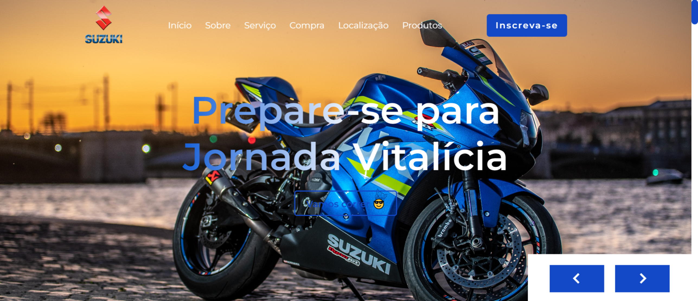

### Website Responsivo Motos Website

 
Site responsivo usando HTML, CSS e JavaScript. Tem uma interface de formulário. Contém um cabeçalho com link de início, sobre, serviço, compra, localização e produtos.

## Pré-visualização:

[motos-website](https://emersonpessoa01.github.io/website-motos/)

 

<!--  -->

